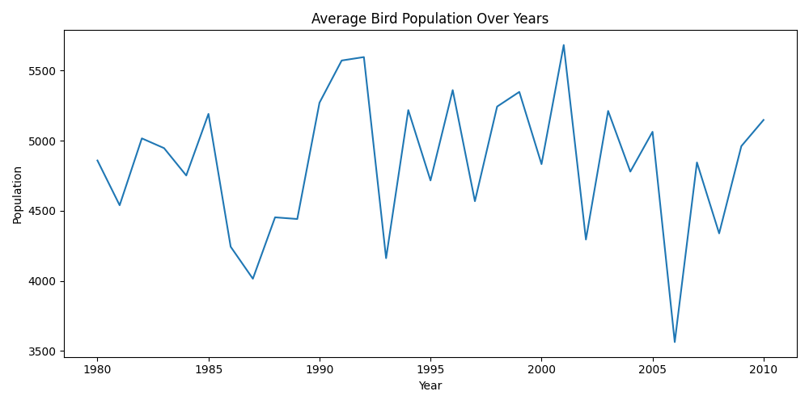
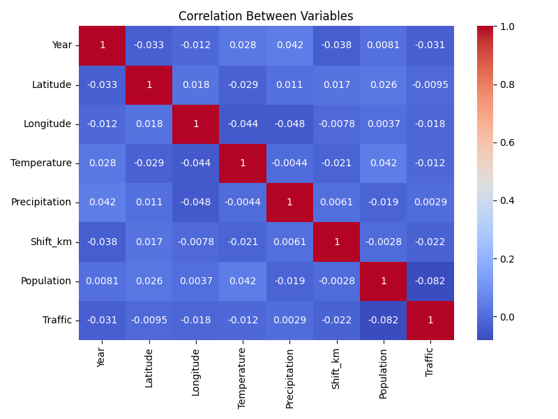
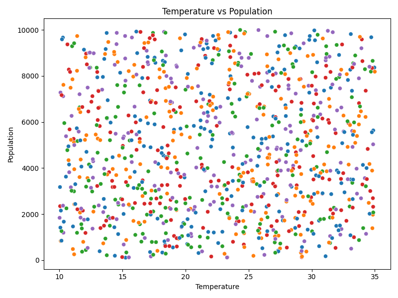
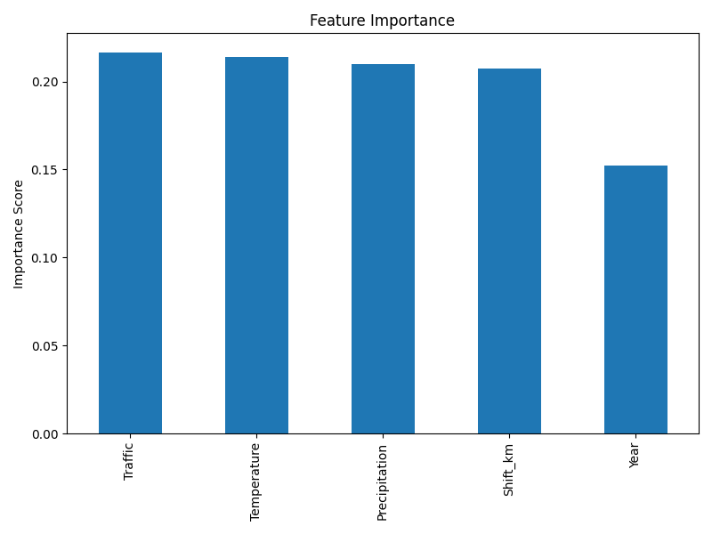

## ICCOB — Climate Impact on Bird Populations

[](https://www.python.org/)
[](https://streamlit.io/)
[](https://scikit-learn.org/)
[](https://pandas.pydata.org/)
[](https://matplotlib.org/)
[](https://seaborn.pydata.org/)
[](https://plotly.com/python/)

An interactive data application and analysis toolkit to explore how climate and anthropogenic factors impact bird populations over time and geography. This repo contains a Streamlit app for exploration and prediction, and an offline analysis script that generates ready‑to‑use visuals and a geospatial HTML map.

### Key Capabilities
- **Exploration**: Filter by species and years; visualize population trends.
- **Relationships**: View correlation heatmaps and scatter plots.
- **Interactive Map**: Drill into sightings with an animated geospatial map.
- **Prediction**: Random Forest model to forecast population under new climate scenarios.
- **Risk Screening**: Linear trend classification to surface declining species and top risks.

---

## Project Structure

```
ICCOB/
├─ app.py                          # Streamlit app (interactive UI + ML + maps)
├─ train.py                        # Offline EDA, model training, figures, and HTML map
├─ Occurance & Climate Data.xlsx   # Input dataset (kept in repo root)
├─ population_trend.png            # Generated figure (EDA)
├─ correlation_heatmap.png         # Generated figure (EDA)
├─ temp_vs_population.png          # Generated figure (EDA)
├─ feature_importance.png          # Generated figure (model)
└─ geo_population_map.html         # Interactive geospatial visualization
```

---

## Data Schema

The app expects the following columns in `Occurance & Climate Data.xlsx`:

- `Bird_Species` (str)
- `Year` (int)
- `Population` (int or float)
- `Temperature` (float, °C)
- `Precipitation` (float, mm)
- `Shift_km` (float, species range shift distance)
- `Traffic` (float/int, anthropogenic pressure index)
- `Latitude` (float)
- `Longitude` (float)
- `Country` (str)

Minimal rows are required for robust modeling; the trend classifier skips species with fewer than 10 records.

---

## Getting Started

### 1) Prerequisites
- Python 3.9+
- Windows, macOS, or Linux

### 2) Create and activate a virtual environment

```bash
python -m venv .venv
# Windows PowerShell
. .venv\\Scripts\\Activate.ps1
# macOS/Linux
source .venv/bin/activate
```

### 3) Install dependencies

```bash
pip install streamlit pandas numpy scikit-learn matplotlib seaborn plotly openpyxl
```

### 4) Place the dataset

- Ensure the file `Occurance & Climate Data.xlsx` is in the project root exactly with that name (note the space and `&`).

---

## Usage

### Option A — Run the interactive Streamlit app

```bash
streamlit run app.py
```

Then, in the browser UI:
- Use the sidebar to download the dataset, select a species, and choose a year range.
- Inspect the population trend line chart and correlation heatmap.
- Review model performance (R² and RMSE) for the selected species.
- Adjust climate scenario sliders to predict future population.
- Explore the interactive map of sightings and population intensity.
- Browse the species trend table and the Top‑5 at‑risk species visualization.

### Option B — Run the offline analysis pipeline

This script produces figures and an HTML geospatial map without launching the app.

```bash
python train.py
```

Outputs will be saved to the project root:
- `population_trend.png`
- `correlation_heatmap.png`
- `temp_vs_population.png`
- `feature_importance.png`
- `geo_population_map.html`

---

## Inside the Streamlit App (`app.py`)

- **Data Loading**: Cached read from `Occurance & Climate Data.xlsx` for snappy interactions.
- **Trend Visualization**: Species‑filtered line plot of `Population` over `Year`.
- **Correlation Heatmap**: Uses numeric columns to illustrate relationships with `Population`.
- **Predictive Model**: RandomForestRegressor trained per species on features:
  - `Temperature`, `Precipitation`, `Shift_km`, `Traffic`, `Year`
  - Metrics: **R²** and **RMSE** on a held‑out test split.
- **Feature Importance**: Horizontal bar chart highlighting strongest drivers.
- **Scenario Prediction**: Sliders accept hypothetical climate values to estimate future population.
- **Map**: Plotly `scatter_mapbox` showing geographic distribution sized and colored by `Population`.
- **Risk Screening**: Linear regression on `Year`→`Population` slope per species to tag `Declining` vs `Stable/Increasing`, with an at‑risk Top‑5 chart.

---

## Visuals

The repository includes generated artifacts for quick reference:









For geospatial exploration, open the interactive HTML map: `geo_population_map.html`.

---

## Modeling Details

- **Model**: RandomForestRegressor (`n_estimators=100`, `random_state=42`).
- **Target**: `Population`.
- **Features**: `Temperature`, `Precipitation`, `Shift_km`, `Traffic`, `Year`.
- **Split**: 80/20 train/test via `train_test_split`.
- **Evaluation**: RMSE and R² reported in the app for the selected species; offline script prints MSE.
- **Interpretation**: Use feature importance to identify levers most associated with population changes. Negative linear slopes in the classifier suggest potential decline.

---

## Reproducibility Tips

- Fix random seeds where applicable (`random_state=42`).
- Ensure numeric columns have correct dtypes; non‑numeric values can affect correlations and modeling.
- Watch for outliers and missing values in `Population` and features; consider imputation or winsorization if needed.

---

## Troubleshooting

- **FileNotFoundError**: Verify `Occurance & Climate Data.xlsx` is in the project root and the name matches exactly.
- **ImportError: openpyxl**: Install `openpyxl` to allow reading Excel files: `pip install openpyxl`.
- **Streamlit not launching**: Confirm the virtual environment is activated and `streamlit` is installed.
- **Blank or odd plots**: Check for non‑numeric strings in numeric columns; clean or cast dtypes.
- **Map tiles not loading**: Internet connection is required for Mapbox tiles when using the default `carto-positron` style.

---

## Extending the Project

- Add model comparisons (e.g., Gradient Boosting, XGBoost, or Linear Models baseline).
- Hyperparameter tuning via cross‑validation.
- Confidence intervals for predictions and trend slopes.
- Additional anthropogenic features (land‑use, protected area coverage, light pollution).
- Export of species‑level reports (PDF/HTML) for conservation planning.

---

## License

Specify your license here, for example: MIT License. If unsure, add a `LICENSE` file or remove this section until finalized.

---

## Acknowledgments

- Built with `Streamlit`, `Pandas`, `scikit‑learn`, `Matplotlib`, `Seaborn`, and `Plotly`.
- Dataset schema inspired by typical biodiversity and climate monitoring workflows.


